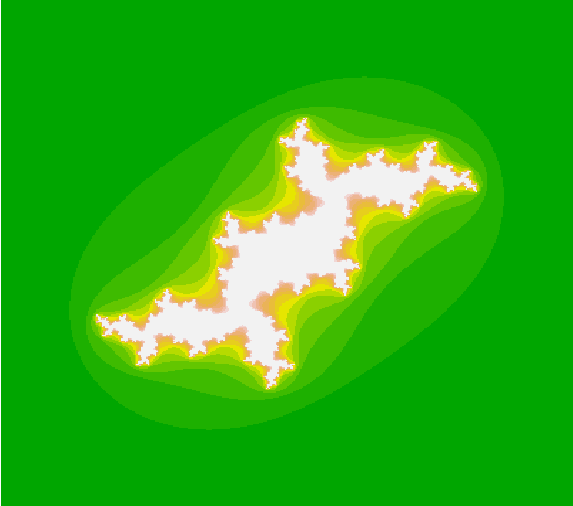

## fractals

### Classical examples: Mandelbrot set and Julia set.

Mandelbrot.R has also implemented Monte-Carlo method to calculate the area. 
For example: fractal made of 15 interations and 100 000 points in Monte-Carlo method give Area=1.8256.
For 20 interations and 1 milion points Area=1.722336. 
Area converges to the real value that is approximately equal to 1.50659.

[Wikipedia](https://en.wikipedia.org/wiki/Adjacency_matrix#Properties)

Example output:

